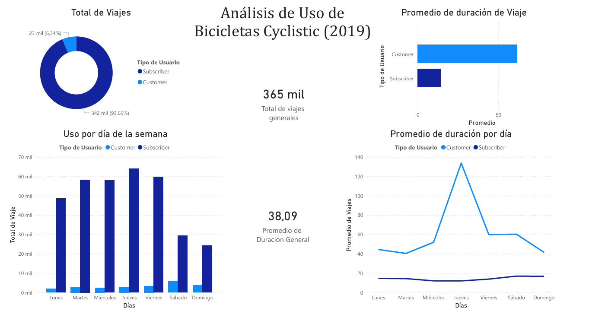
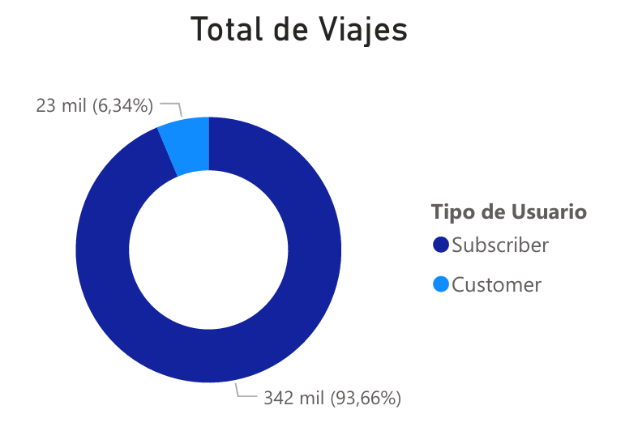
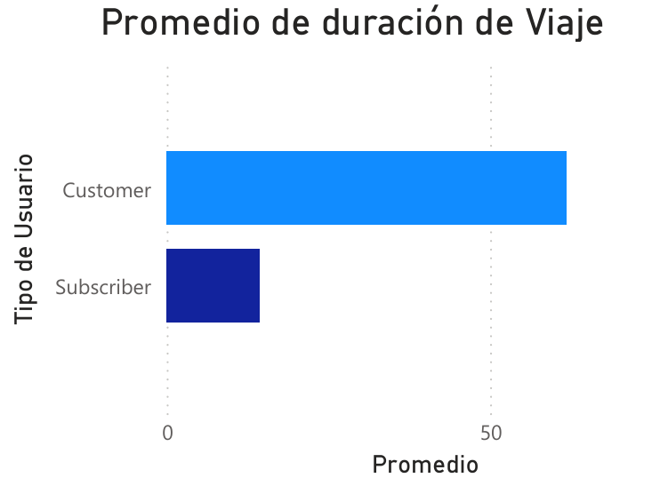
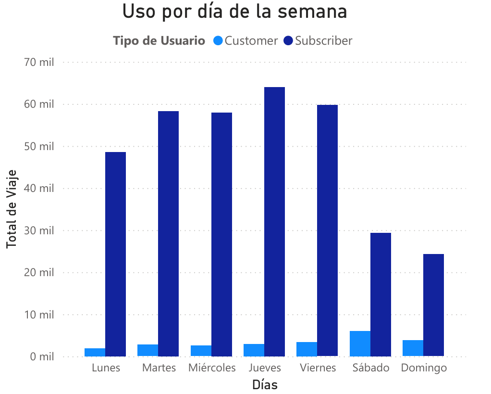

# Análisis de Uso de Bicicletas - Caso Cyclistic (2019) 🚲

## 📌 Resumen del Proyecto

Este proyecto es el caso de estudio final del **Certificado Profesional de Análisis de Datos de Google**. El objetivo es analizar los datos históricos de viajes de la empresa de bicicletas compartidas Cyclistic para entender cómo difieren los usuarios anuales ("Subscribers") de los usuarios ocasionales ("Customers").

## 🛠️ Herramientas Utilizadas

* **Microsoft Excel:** Exploración inicial y limpieza de datos crudos.

* **SQL Server:** Consultas, transformación de datos y cálculo de métricas agregadas.

* **Power BI:** Visualización de datos y creación del dashboard interactivo.

## 🧹 Proceso de Limpieza y Transformación de Datos

Durante la preparación de los datos, me aseguré de garantizar la integridad del análisis mediante las siguientes acciones:

1. **Creación de columnas para el analisis:** Se crearon 2 columnas llamadas (`ride_length_min`) y  (`day_of_week`) para contabilizar correctamente los viajes y en los días de la semana en los que se hacen estos viajes.

2. **Manejo de Outliers:** Se identificaron años de nacimiento irreales (ej. 1900). Para no afectar el volumen total de viajes en el análisis general, estas celdas se convirtieron en valores `NULL`, en lugar de eliminar las filas completas.

3. **Estandarización de Fechas:** Conversión de las fechas de inicio y fin al formato ISO `YYYY-MM-DD HH:MM:SS` para su correcto procesamiento en bases de datos relacionales.

## 📊 Visualización de Resultados

A continuación, presento los hallazgos clave de mi análisis en Power BI:

### Dashboard General

### Total de Viajes y Promedios por Tipo de Usuario

* *Insight:* La gran mayoría de los viajes (93.6%) son realizados por usuarios suscritos (Subscribers). Sin embargo, los usuarios ocasionales (Customers) tienen un promedio de duración de viaje significativamente mayor.

### Uso por Día de la Semana

* *Insight:* Los usuarios "Subscriber" tienen un uso constante de lunes a viernes, lo que sugiere que usan las bicicletas para ir al trabajo. Los "Customers" tienen un ligero aumento durante los fines de semana.

## 💡 Conclusiones y Recomendaciones

1. **Enfoque de Marketing de Fin de Semana:** Dado que los usuarios ocasionales tienen picos de uso y mayor duración de viaje durante los fines de semana, se recomienda lanzar campañas de suscripción anual con beneficios exclusivos de fin de semana para convertirlos.

2. **Campañas de temporada:** El uso de las bicicletas está fuertemente ligado al clima y eventos en la ciudad. Las estrategias de retención deben enfocarse en los meses previos al verano.

---

*Proyecto creado por Gianello Marcos como parte del portafolio de Análisis de Datos.*
